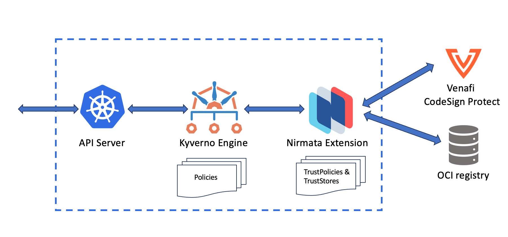

# kyverno-notation-venafi

A [Kyverno](https://kyverno.io) extension service that executes the [notation-venafi-csp](https://github.com/Venafi/notation-venafi-csp) plugin for [Notation](https://notaryproject.dev/) to verify image signatutes and attestations.

[](https://goreportcard.com/report/github.com/nirmata/kyverno-notation-venafi)




# Features

## Image Signature Verification

The Nirmata extension service is invoked from a Kyverno policy which passes it a list of images to be verified. The service then verifies [notation](https://notaryproject.dev/) format signatures for container images using the [notation-venafi-csp](https://github.com/Venafi/notation-venafi-csp) notation plugin and returns responses back to Kyverno.

The service manages Notation [trust policies](https://github.com/notaryproject/specifications/blob/main/specs/trust-store-trust-policy.md#trust-policy) and [trust stores](https://github.com/notaryproject/specifications/blob/main/specs/trust-store-trust-policy.md#trust-store) as Kubernetes resources.

## Image Digest Mutation

To ensure image integrity and prevent tampering, the sevice replaces image tags, which are mutable and can be spoofed, with digests.  

The Kyverno policy passes the `images` variable to the services' `/checkimages` endpoint. The result returns a list of images with their JSON path and digests so Kyverno can mutate each image in the admission payload. 

Here is an example:

**Response object structure**

```json
{
  "verified": true,
  "message": "...",
  "results": [
    {
       "name": "container1",
       "path":  "/spec/containers/0",
       "image":  "ghcr.io/nirmata/kyverno-notation-venafi-demo@sha256:b31bfb4d0213f254d361e0079deaaebefa4f82ba7aa76ef82e90b4935ad5b105"
    } 
  ]
}
```

**Kyverno policy fragment**

```yaml 
mutate:
   foreach:
   - list: "response.results"
     patchesJson6902: |-
       - path: {{ element.path }}
         op: replace
         value: {{ element.image }}
```

## Attestation Verification

In addition to verifying signatures, the extension service can verify signed metadata i.e. [attestations](https://nirmata.com/2022/03/15/a-map-for-kubernetes-supply-chain-security/).

To verify attestations, the Kyverno policy can optionally pass a variable called `attestations` in the request:

```yaml
- key: attestations
  value:
    - imageReference: "*"
      type: 
        - name: sbom/cyclone-dx
          conditions:
            all:
            - key: \{{creationInfo.licenseListVersion}}
              operator: Equals
              value: "3.17"
              message: invalid license version
        - name: application/sarif+json
          conditions:
            all:
            - key: \{{ element.components[].licenses[].expression }}
              operator: AllNotIn
              value: ["GPL-2.0", "GPL-3.0"]
    - imageReference: "ghcr.io/nirmata/kyverno-notation-venafi-demo*"
      type:
        - name: application/vnd.cyclonedx
          conditions:
            all:
            - key: \{{ element.components[].licenses[].expression }}
              operator: AllNotIn
              value: ["GPL-2.0", "GPL-3.0"]
```

The `attestations` variable is a JSON array of where each entry has:
1. an `imageReference` to match images; 
2. a type which specifies the name of the attestation; and 
3. a list of conditions we want to verify the attestation data

In the  example above we are verifying the following: 
1. the attestations `sbom/cyclone-dx` and `application/sarif+json` exist for all images
2. the `creationInfo.licenseListVersion` is equal to 3.17 in the SBOM and GPL licenses are not present.
3. the attetestion `application/vnd.cyclonedx` is available for all versions of the `ghcr.io/nirmata/kyverno-notation-venafi-demo:signed ` image and does not contain GPL licenses.

**NOTE:** The conditions key in the attestations must be escaped with `\` so kyverno does not substitute them before executing the extension service.

## Caching

To prevent repeated lookups for verified images, the Nirmata extension has a built-in cache.

Caching is enabled by default and can be managed using the `--cacheEnabled` flag. The cache is a TTL based cache, i.e, entries expire automatically after some time and the value of TTL can be customized using `--cacheTTLDurationSeconds` (default is 3600) and max number of entries in the cache can be configured using `--cacheMaxSize` (default is 1000).

The cache stores the verification outcomes of images for the trust policy and verification outcomes of attestations with the trust policy and conditions. The cache is an in-memory cache which gets cleared when the pod is recreated. Cache will also be cleared when there is any change in trust policies and trust stores.

## Multi-Tenancy

In a shared cluster, each team may have different signatures and trust policies. To support such use cases, the extension allows configuring multiple [trust policies](https://github.com/notaryproject/specifications/blob/main/specs/trust-store-trust-policy.md#trust-policy) and [trust stores](https://github.com/notaryproject/specifications/blob/main/specs/trust-store-trust-policy.md#trust-store) as Kubernetes custom resources.

The extension service allows specifying what trust policy they want to use for verification thus enabling multi-tenancy. Multiple teams can share one cluster and have different trust policies separate from each other.
To specify the trust policy to use, we can pass the `trustPolicy` variable in the request.
```yaml
 - key: trustPolicy
   value: "tp-{{request.namespace}}"
```
or we can set the `DEFAULT_TRUST_POLICY` env variable. In the above example we are dynamically using the trust policy for the namespace of the request.

## High Availability

Kyverno-notation-venafi can be installed in a highly-available manner where additional replicas can be deployed for the plugin. The plugin does not use leader election for inbound API requests which means verification requests can be distributed and processed by all available replicas. Leader election is required for certificate management so therefore only one replica will handle these tasks at a given time.

Multiple replicas configured for the plugin can be used for both availability and scale. Vertical scaling of the individual replicas’ resources may also be performed to increase combined throughput.

# Setup

1. Install [notation-venafi-csp](https://github.com/Venafi/notation-venafi-csp/tree/main#installation) plugin using the installation guide.
   
2. Set up an environment inside a venafi project to use it for signing and verification.

3. Get the access key to access your environment.
```sh
curl --location '${VENAFI_CLIENT_URL}/vedauth/authorize/oauth' \ 
--header 'Content-Type: application/json' \
--data '{
   "client_id":"vsign-sdk",
   "password":"********",
   "scope":"codesignclient;codesign",
   "username":"********"
}'
```

4. Create a config.ini file of the following format
```txt
tpp_url=
access_token=
tpp_project=${PROJECT}\\${ENVIRONMENT}
```
5. Add the key to notation CLI.

```sh
notation key add --default "vsign-rsa2048-cert" --plugin venafi-csp --id "vsign-rsa2048-cert" --plugin-config "config"="/path/to/vsign/config.ini"
```


7. Sign the image using `notation` and notation-venafi-csp plugin:

```sh
notation sign --key "vsign-rsa2048-cert" $IMAGE
```

# Install

1. Install Kyverno in the cluster

```sh
kubectl create -f https://raw.githubusercontent.com/kyverno/kyverno/main/config/install-latest-testing.yaml
```

2. Install the kyverno-notation-venafi extension service

```sh
kubectl apply -f configs/install.yaml
```

3.  Get the certificate to be used for verification using `pkcs11config` cli and add it to the trust store.
```sh
pkcs11config getcertificate -label:venafi-test-notation-venafi-csp -file venaficert1.crt
```

4. Create CRs for Notation TrustPolicy and TrustStore

```sh
kubectl apply -f configs/crds/
```

```sh
kubectl apply -f configs/samples/truststore.yaml
```

```sh
kubectl apply -f configs/samples/trustpolicy.yaml
```

4. Apply the policy to the cluster

```sh
kubectl apply -f configs/samples/kyverno-policy.yaml
```

6. Test signed and unsigned images:

Create the test namespace which the [policy](configs/samples/kyverno-policy.yaml) applies to:

```sh
kubectl create ns test-venafi
```

Run a signed image:

```sh
kubectl -n test-venafi run test --image=ghcr.io/nirmata/kyverno-notation-venafi-demo:signed --dry-run=server
```
Output
```sh
pod/test created (server dry run)
```
Attempt to run an unsigned image:

```sh
kubectl -n test-venafi run test --image=ghcr.io/nirmata/kyverno-notation-venafi-demo:unsigned --dry-run=server
```
Output
```sh
Error from server: admission webhook "mutate.kyverno.svc-fail" denied the request: mutation policy check-venafi error: failed to apply policy check-venafi rules [call-venafi-signer-extension: failed to evaluate list response.results: failed to fetch data for APICall: HTTP 406 Not Acceptable: failed to verify container kyverno-notation-venafi-demo: failed to verify image {{ghcr.io kyverno-notation-venafi-demo nirmata/kyverno-notation-venafi-demo unsigned } /spec/containers/0/image}: no signature is associated with "ghcr.io/nirmata/kyverno-notation-venafi-demo@sha256:21dda7875fa6d0058c4443facda8ae27a025cf71a6875abe720cc2ff08c7cc98", make sure the artifact was signed successfully
: failed to fetch data for APICall: HTTP 406 Not Acceptable: failed to verify container kyverno-notation-venafi-demo: failed to verify image {{ghcr.io kyverno-notation-venafi-demo nirmata/kyverno-notation-venafi-demo unsigned } /spec/containers/0/image}: no signature is associated with "ghcr.io/nirmata/kyverno-notation-venafi-demo@sha256:21dda7875fa6d0058c4443facda8ae27a025cf71a6875abe720cc2ff08c7cc98", make sure the artifact was signed successfully
]
```
# Troubleshoot

1. Check service

```sh
kubectl -n kyverno-notation-venafi logs deploy/kyverno-notation-venafi -f
```

The logs should show:

```sh
2023-04-30T18:22:28.438Z	INFO	kyverno-notation-venafi/main.go:46	configuring notation	{"dir.UserConfigDir": "/notation", "dir.UserLibexecDir": "/notation"}
2023-04-30T18:22:28.459Z	INFO	kyverno-notation-venafi/verify.go:65	initialized	{"namespace": "kyverno-notation-venafi", "secrets": "regcred"}
2023-04-30T18:22:28.460Z	INFO	kyverno-notation-venafi/main.go:68	Listening...
```


2. Run netshoot

```sh
kubectl run netshoot --rm -i --tty --image nicolaka/netshoot
```
